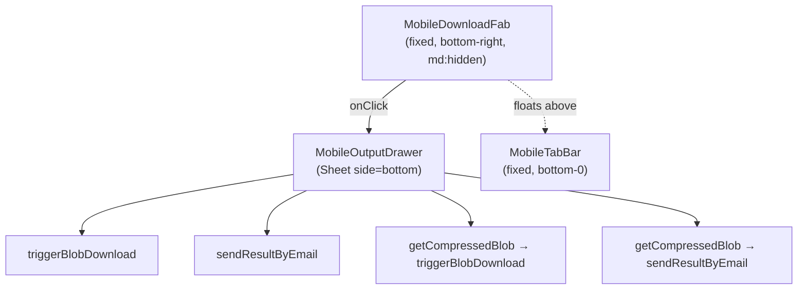

# Mobile Download Action Drawer

## Architecture



## New files

### `components/mobile-download-fab.tsx`
Single-responsibility: render the fixed pill button. Renders `null` when `blob` is null.

```tsx
// Props
type MobileDownloadFabProps = {
  blob: Blob | null;
  onClick: () => void;
};
// Position: "fixed right-4 z-40 md:hidden bottom-mobile-nav"
// bottom-mobile-nav already defined in globals.css:
//   bottom: calc(4rem + env(safe-area-inset-bottom, 0px))
// Uses PrimaryActionButton with Download icon (Lucide)
```

### `components/mobile-output-drawer.tsx`
Single-responsibility: render the action sheet. Uses `Sheet` from `components/ui/sheet.tsx` with `side="bottom"`.

```tsx
type MobileOutputDrawerProps = {
  open: boolean;
  onOpenChange: (open: boolean) => void;
  blob?: Blob | null;
  getBlob?: () => Promise<Blob | null>;      // lazy re-export (edit-pdf, unlock)
  filename: string;
  toolLabel: string;
  supportsCompression?: boolean;             // default false
  getCompressedBlob?: () => Promise<Blob | null>;
};
```

Internal state: `emailMode: "none" | "plain" | "compressed"`, `email: string`, `loading: boolean`.

**Drawer layout (when `supportsCompression=true`):**
- Header: drag handle + filename + "Ready to download" subtext
- 2x2 button grid:
  - Download (`triggerBlobDownload` → close)
  - Email (reveals email input for plain blob)
  - Download Compressed (`getCompressedBlob()` → `triggerBlobDownload` → close)
  - Email Compressed (reveals email input for compressed blob)
- When emailMode is active: animated email input + Send button slide in below grid
- Loading state disables all buttons + shows spinner on active action
- Error surfaces via `toast.error`; success via `toast.success` + close

**When `supportsCompression=false`:** only 2 buttons (Download, Email) in a single row.

**Error handling:** follows DEVELOPER_GUIDE §14 — all `catch (err)`, `console.error`, `toast.error`.

**Copy:** no em dashes. "Download", "Email", "Download compressed", "Email compressed", "Sending…".

## Per-tool option matrix

- Merge: `supportsCompression={true}`, `getCompressedBlob` uses `processCompress(file, "medium")`
- Split: `supportsCompression={false}`
- Compress: `supportsCompression={false}` (output is already compressed)
- Edit PDF: `supportsCompression={true}`, `getBlob` re-exports, `getCompressedBlob` compresses re-export
- Image to PDF: `supportsCompression={true}`, `getCompressedBlob` uses `processCompress(file, "medium")`
- PDF to Image: `supportsCompression={false}` (ZIP output)
- Unlock: `supportsCompression={true}`, `getBlob` re-unlocks, `getCompressedBlob` compresses re-unlock

## Changes per tool client

Each of the 7 `*-client.tsx` files gets:
1. `const [drawerOpen, setDrawerOpen] = useState(false)` 
2. A `getCompressedBlob` callback (tools that support it) — wraps result blob in `new File([blob], filename, { type: "application/pdf" })` then calls `processCompress(file, "medium")`
3. At bottom of JSX:
```tsx
<MobileDownloadFab blob={resultBlob} onClick={() => setDrawerOpen(true)} />
<MobileOutputDrawer
  open={drawerOpen}
  onOpenChange={setDrawerOpen}
  blob={resultBlob}
  filename={downloadFilename}
  toolLabel="..."
  supportsCompression={...}
  getCompressedBlob={...}
/>
```

The existing right-sidebar / `ToolResultFooter` is **left unchanged** — it continues to serve desktop and acts as a fallback on mobile.

## Positioning detail

The `.bottom-mobile-nav` utility already exists in `app/globals.css`:
```css
.bottom-mobile-nav {
  bottom: calc(4rem + env(safe-area-inset-bottom, 0px));
}
```
The FAB uses this class + `right-4 fixed z-40 md:hidden`. No new CSS variables needed.

## DEVELOPER_GUIDE.md update

Per §2 rule: add `mobile-download-fab.tsx` and `mobile-output-drawer.tsx` to the structure tree.

## Files to create/modify

- `components/mobile-download-fab.tsx` — create
- `components/mobile-output-drawer.tsx` — create
- `app/(tools)/merge/merge-client.tsx` — add FAB + drawer
- `app/(tools)/split/split-client.tsx` — add FAB + drawer
- `app/(tools)/compress/compress-client.tsx` — add FAB + drawer
- `app/(tools)/edit-pdf/edit-pdf-client.tsx` — add FAB + drawer
- `app/(tools)/image-to-pdf/image-to-pdf-client.tsx` — add FAB + drawer
- `app/(tools)/pdf-to-image/pdf-to-image-client.tsx` — add FAB + drawer
- `app/(tools)/unlock/unlock-client.tsx` — add FAB + drawer
- `DEVELOPER_GUIDE.md` — update structure tree
