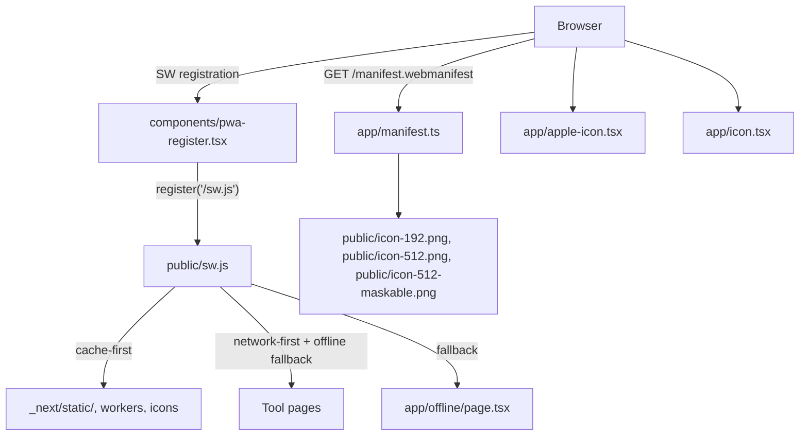

# PWA Full Readiness

Make Pdfer a fully compliant PWA: installable on Android (Chrome install prompt), installable on iOS (Add to Home Screen with correct icon and standalone behavior), and functional with an offline fallback.

## Architecture



## What changes

### New files

- **`scripts/generate-icons.mjs`** — Node script using `sharp` (already a dep) to rasterize an SVG logo into `public/icon-192.png`, `public/icon-512.png`, `public/icon-512-maskable.png`. The icon design: orange circle (`#C15F3C` = the primary color) with white "P" letter, centered. Maskable variant has full bleed background for Android adaptive icons.

- **`app/manifest.ts`** — Next.js `MetadataRoute.Manifest` export:
  - `name: "Pdfer"`, `short_name: "Pdfer"`
  - `start_url: "/"`, `scope: "/"`
  - `display: "standalone"`
  - `theme_color: "#C15F3C"` (primary orange), `background_color: "#FAFAF7"` (cream)
  - `icons`: 192, 512, and 512 maskable from `public/`

- **`app/icon.tsx`** — Next.js ImageResponse favicon (32×32), same "P" design. Wired automatically by Next.js as `<link rel="icon">`.

- **`app/apple-icon.tsx`** — Next.js ImageResponse apple touch icon (180×180). Wired automatically as `<link rel="apple-touch-icon">`.

- **`public/sw.js`** — Manual service worker (no Serwist needed, keeps zero new deps):
  - **Install**: caches `/offline` only (minimal precache — avoids stale SSR HTML)
  - **Activate**: removes old cache versions, calls `clients.claim()`
  - **Fetch**:
    - `_next/static/`, `/workers/`, `/pdf.worker.min.mjs`, `/icons/` → **cache-first** (immutable hashed assets)
    - `mode: navigate` → **network-first** with 4s timeout → on failure, serve `/offline`
    - Everything else → network-only (API routes, server actions)

- **`app/offline/page.tsx`** — Simple offline fallback page styled with existing design tokens. Shows "You're offline — reconnect to use Pdfer." with a retry button.

- **`components/pwa-register.tsx`** — `"use client"` component that calls `navigator.serviceWorker.register('/sw.js', { scope: '/' })` in a `useEffect`. Mounted once in the root layout.

### Modified files

- **[`app/layout.tsx`](app/layout.tsx)** — extend `metadata` and `viewport`:
  ```ts
  export const metadata: Metadata = {
    // existing fields...
    applicationName: "Pdfer",
    appleWebApp: {
      capable: true,
      statusBarStyle: "default",
      title: "Pdfer",
    },
    formatDetection: { telephone: false },
    openGraph: { type: "website", title: "Pdfer", description: "..." },
  }
  export const viewport = {
    // existing fields...
    themeColor: [
      { media: "(prefers-color-scheme: light)", color: "#C15F3C" },
      { media: "(prefers-color-scheme: dark)", color: "#C15F3C" },
    ],
  }
  ```
  Add `<PwaRegister />` inside `<Providers>`.

- **[`next.config.ts`](next.config.ts)** — add `headers()` to set `Cache-Control: no-cache` on `/sw.js` (so browsers never serve a stale service worker) and `Content-Type: application/javascript` to ensure Netlify Edge serves it correctly.

- **[`package.json`](package.json)** — add `"build:icons": "node scripts/generate-icons.mjs"` and prepend it to both `dev` and `build` scripts so icons are always fresh before the Next.js build.

## Platform coverage after this change

- **Android Chrome**: manifest + SW + icons = install prompt shown, standalone mode, offline page
- **iOS Safari 16.4+**: `appleWebApp.capable`, apple-touch-icon, manifest = proper Add to Home Screen with standalone mode and correct icon
- **iOS Safari < 16.4**: degrades gracefully — still has correct icon and opens in browser
- **Chrome desktop / Brave**: install prompt via manifest + SW
- **Firefox**: manifest recognized, no install prompt (Firefox behavior), but icon/standalone work
- **Samsung Internet**: same as Chrome — full install

## What is NOT in scope
- Push notifications (requires VAPID keys, database, separate feature)
- Custom `beforeinstallprompt` Android banner (native prompt is sufficient)
- Full offline tool operation for server-dependent tools (mupdf/sharp routes — only the offline page is served, not stale tool HTML)
